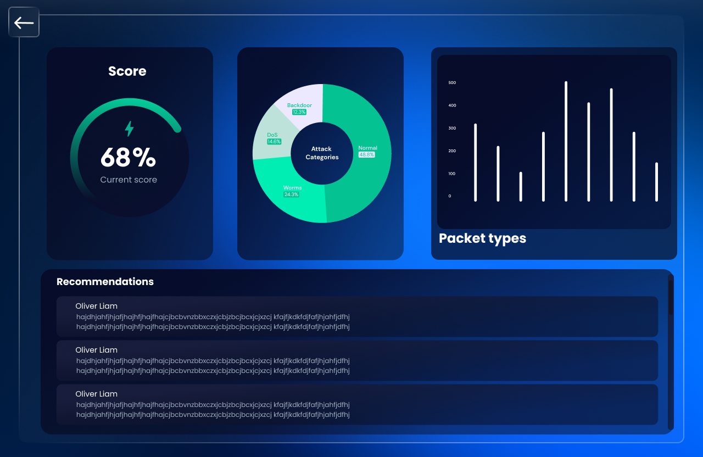

# ML-TISS
ML-Driven Threat Intelligence Scoring System (ML-TISS) Dashboard
Overview
The ML-Driven Threat Intelligence Scoring System (ML-TISS) is a sophisticated cybersecurity tool that utilizes advanced machine learning algorithms to analyze network traffic and identify potential cyber threats. This repository includes the code for the ML-TISS dashboard, which provides a visual representation of threat analysis results, allowing organizations to quickly understand their cybersecurity posture and take appropriate actions.

Dashboard Components
The ML-TISS Dashboard is designed to provide a comprehensive overview of an organization's network security through various interactive components. Each component focuses on different aspects of threat intelligence:

1. Upload Screen
Functionality:

Allows users to upload a CSV file containing network packet data from the organization's network. This data is then processed by the ML-TISS to generate security scores and recommendations.
This initial interaction point is crucial for beginning the analysis process.

2. Pie Attack Categories
Visualization:

Displays a pie chart that represents the percentage distribution of different types of attack vectors detected within the uploaded data.
This visual helps in quickly identifying the most prevalent types of attacks that the organization is facing.
3. Overall Threat Score
Visualization:

Shows a circular score gauge that indicates the overall threat level as a percentage. The current score is dynamically updated based on the analysis of the uploaded packet data.
This component provides a snapshot of the current security status, highlighting the urgency and extent of potential threats.
4. Packet Types Graph
Visualization:

Presents a bar graph detailing the count of each type of attack packet detected.
This graph provides insights into the frequency of specific attack types, helping to pinpoint areas where security measures may need to be reinforced.
5. Recommendations
Functionality:

Lists actionable security recommendations tailored to the organization based on the detected threats and their scores. These recommendations aim to enhance the organization's security measures.
Each recommendation is directly linked to the types of vulnerabilities identified, ensuring that advice is relevant and immediately applicable.
